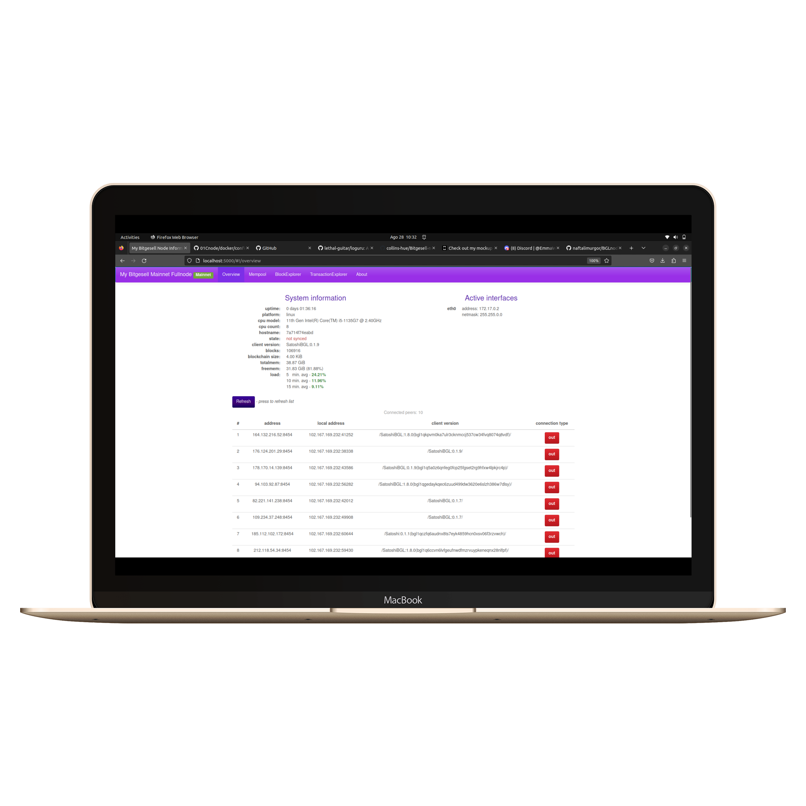
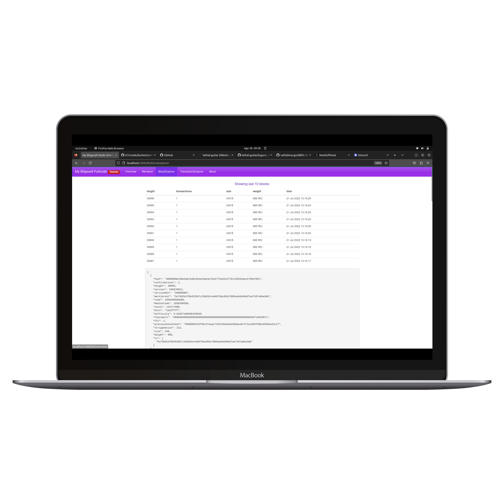

# Bitgesell-node-monitor


This is a webfrontend for a full Bitgesell node. Bitgesell-node-monitor is running as the backend and this little app allows you to see the status of the node on the web. 


# How it works
The application consists of the following pages:
1. overview - shows basic info about the node like processor count, available memorry, active interfaces, connected peers, client version, number of blocks, synced state, etc.

2. mempool - page shows total mempool entries, size of the mempool, to how many blocks would the transactions roughly fit, transaction size, weight and if the transaction has a witness (is segwit). Shows the last 10 txes in realtime that the BGLd client sent us through zeromq. 

3. block explorer - the 10 latest blocks are shown, their size, weight, timestamp 

5. transaction explorer - details about a TX are shown once the hash is included in the search bar


# docker setup (Linux/macOS):
 - Install bitgesell core [bitgesell-core](https://gist.github.com/naftalimurgor/45872acbf5fa9c18ab08e46e66e2d3ff)
 - install docker
 - clone this repo:
 
 ```
 git clone https://github.com/collins-hue/Bitgesell-node-monitor.git && cd Bitgesell-node-monitor

 ```
  - Get permission to connect to the Docker daemon socket

 ```
sudo chmod 666 /var/run/docker.sock

 ```
 - then run helper script:
 
 ```
 ./docker_build.sh
 ```
 
example output (note first time build takes some time and outputs much more logs):

``` 
setup Bitgesell-node-monitor for you?
y/N
y
which network to setup?
1) regtest
2) testnet
3) mainnet
default: testnet
3
configuring for mainnet
running docker for you
+ cp docker/config/default.mainnet.yaml config/default.yaml
+ set +x
[+] Building 172.5s (12/12) FINISHED                                                      
 => [internal] load .dockerignore                                                    0.2s
 => => transferring context: 2B                                                      0.0s
 => [internal] load build definition from Dockerfile                                 0.4s
 => => transferring dockerfile: 189B                                                 0.0s
 => [internal] load metadata for docker.io/library/node:8                            3.1s
 => [1/7] FROM docker.io/library/node:8@sha256:a681bf74805b80d03eb21a6c0ef168a97610  0.0s
 => [internal] load build context                                                    1.8s
 => => transferring context: 966.94kB                                                0.2s
 => CACHED [2/7] WORKDIR /bitgesell                                                  0.0s
 => [3/7] WORKDIR /opt/bitgesell                                                     2.3s
 => [4/7] COPY package*.json ./                                                      1.8s
 => [5/7] RUN npm install                                                          105.1s
 => [6/7] COPY . .                                                                   3.4s 
 => [7/7] RUN npm run build                                                         28.4s 
 => exporting to image                                                              22.6s 
 => => exporting layers                                                             21.7s 
 => => writing image sha256:49ec207981ec5514509d854b840b4d17404e24b9927956da3b25f79  0.3s 
 => => naming to docker.io/library/bitgesell-node-monitor                            0.5s 

edit config/default.yaml to reflect your configuration
make sure you set the correct rpc username/password

done.

 ```
 - edit `config/default.yaml` rpc information. Change it to whatever you supplied to `BGLd`. All other configuration options were prefilled for you. Do not change them unless you know what you are doing.
 
 ```
  rpc_username: secretuser
  rpc_password: secretpass


 ```
 - start the container
 
 ```
 docker run -it -p 5000:5000 bitgesell-node-monitor
 ```

example output:

```
user@host:~/Bitgesell-node-monitor$ docker run -it -p 5000:5000 bitgesell-node-monitor
logging to file: /opt/Bitgesell-node-monitor/server.log

server is now running on port 5000
```

 - point your browser to http://localhost:5000
 
 - hit `ctrl+c` if you want to finish bitgesell-node-monitor
  

# manual setup:
- Install bitgesell core [bitgesell-core](https://gist.github.com/naftalimurgor/45872acbf5fa9c18ab08e46e66e2d3ff)

- if building from source, build it with zeromq support (zeromq is needed for the mempool page to work, in case you do not want to see realtime tranasctions this step can be ommited). If you use the binary from the official site that has zeromq already in it!

- make some extra bitcoin configuration to make the frontend work (note: turning on txindex will require to reindex the whole blockchain which takes a lot of time, you were warned :). You can ignore that setting, the TransactionExplorer page will only show your transactions in that case. ). I recommend running this frontend with bitcoin-core launched with -disablewallet (or add disablewallet=1 to bitcoin.conf) in case you did not read the source code of this tool fully - you should never trust anyone
```
daemon=1
rpcuser=<some user>
rpcpassword=<a very secret password>
server=1
rest=1
zmqpubhashtx=tcp://127.0.0.1:28332
zmqpubhashblock=tcp://127.0.0.1:28332
zmqpubrawblock=tcp://127.0.0.1:28332
zmqpubrawtx=tcp://127.0.0.1:28332
txindex=1
disablewallet=1
```
- get this repo via git and edit the file config/default.yaml - the credentials should be the same as in your bitcoin.conf. Also adjust the host and port accordingly. Make sure you set your home dir if not the default in the config file.
```
RPC:
  host: localhost
  port: 8332
  rpc_username: <some username>
  rpc_password: <a very secret password>
```
- then install the dependencies:
```
npm install
```
- build the javascript bundle file
```
npm run build
```
- and start the web frontend (please note it will run in a console, do not close it or your webserver will quit, still in developement, will be fixed later to deamonize)
```
node server.js
```
- browse to http://localhost:5000 to view the page (assuming bitcoin-core and the web frontend are on the same node)

# Todos:

For pending features, see issues page
